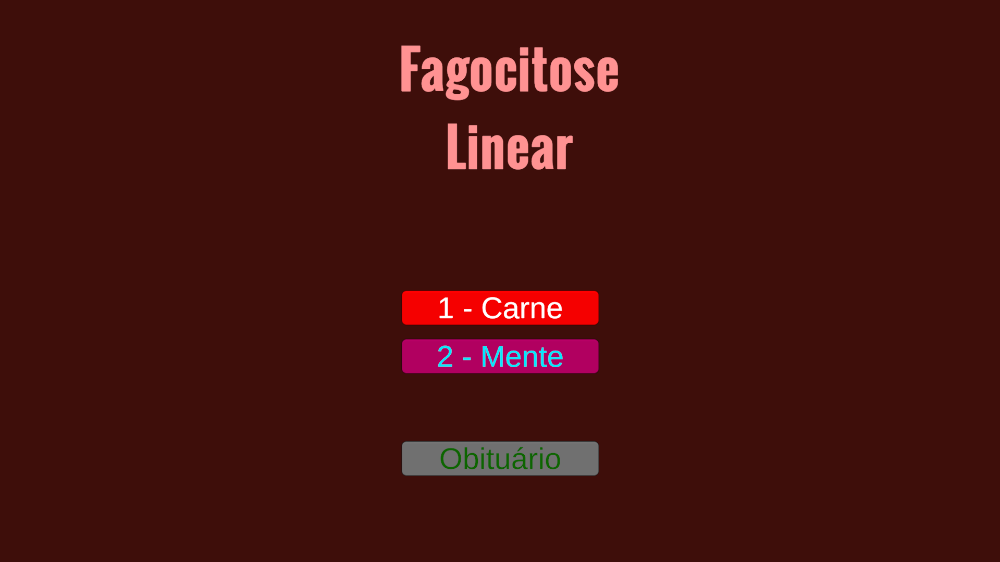
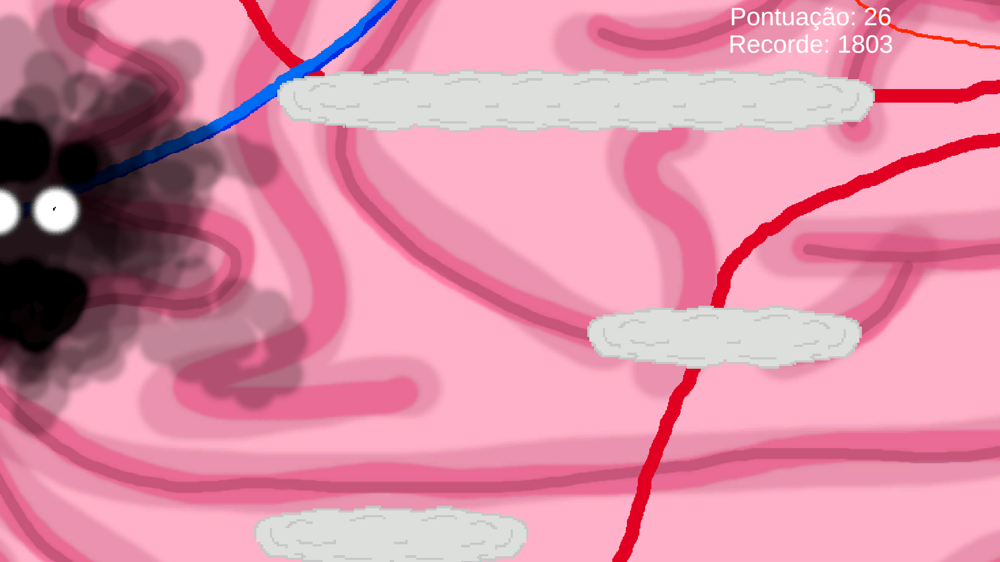
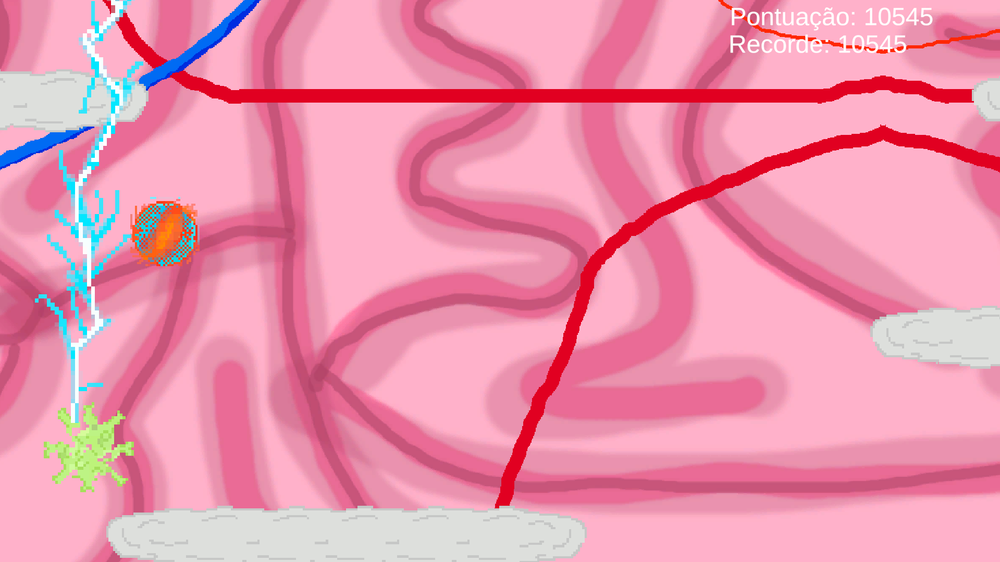

# Fagocitose Linear

Fagocitose Linear is a 2D Infinite Runner game (somewhat) set on a human body, where you play as an white cell that must destroy the most number of viruses to earn points.

There are two phases
 - "Carne" (Meat), set on the inner of a torax where you jump around bones, to catch green and silver viruses.

 - "Mente" (Mind), set on the brain of a hallucinating patient, here you can find the green, silver and gold viruses, the "Pílula Magnética (magnetic pill) which allows you to defeat farther viruses by shocking them, but also have to deal with the "Brancos" (Blanks), which makes you unable to know where you are for long seconds, which is most times deadly.

Fagocitose Linear was made as an activity to my "Programming for Digital Games" class, which continues what we learned at "Programming for Games" class, it runs on Windows and Android.

### Namesake
 - Fagocitose (Phagocytosis in Portuguese) is the process of a cell eating another one, which is one of the defense methods of the human body agains't viruses and bacteria, which is the theme of the game, a white cell fighting viruses. 
 - Linear: Following a line, just as this game, that is a 2D Infinite Runner.
